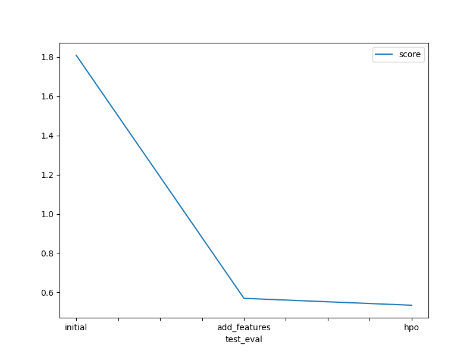
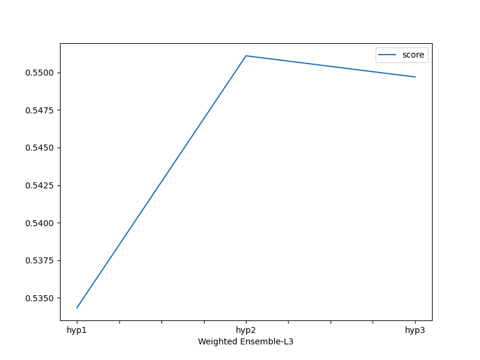

# Report: Predict Bike Sharing Demand with AutoGluon Solution
#### NAME HERE Mariam Ahmed Elsendiony
### What was the top performing model?
WeightedEnsembleL3 with RMSE = 0.53433
## Initial Training
### What did you realize when you tried to submit your predictions? What changes were needed to the output of the predictor to submit your results?
TODO: Add your explanation
I had to install Kaggle using !pip install kaggle, also I had to change the set up tool version as it was higher and upgraded bokeh as they caused errors. 
I also didn't know that negative entries are not allowed in kaggle.

## Exploratory data analysis and feature creation
### What did the exploratory analysis find and how did you add additional features?
I started with trying neural networks and forest hyperparameters and from there I realised that the model is more affected by some hyperparameters than others.

### How much better did your model preform after adding additional features and why do you think that is?
It improved alot,The feature "datetime" was hourly information so I added data for "year", "month", "day", and "hour as distinct features from "datetime". Additionally, "season" and "weather" were transformed to categorical type. 
Also, the additional features from datetime would have certainly helped the model get more information to learn from.
the RMSE went from 1.8088 to  0.56963 which is a significant decrease as we know the closer the RMSE to zero the better.almost 68% improvement.
## Hyper parameter tuning
### How much better did your model preform after trying different hyper parameters?
It varied depending on the hyper parameters and the number of trials and epochs.
At the beginning the GM and RF improved the model significantly, the NN didn't improve it as much, The mix of both was better but not the best.
### If you were given more time with this dataset, where do you think you would spend more time?

I would try different search methods for hyper tuning, increase the number of trials.
### Create a table with the models you ran, the hyperparameters modified, and the kaggle score.
|model|hpo1|hpo2|hpo3|score|
|--|--|--|--|--|
|initial|default|default|default|1.8088|
|add_features|default|default|default|0.56963|
|hpo|RF and GM|NN_torch|both|0.4907|

### Create a line plot showing the top model score for the three (or more) training runs during the project.

TODO: Replace the image below with your own.

### Create a line plot showing the top kaggle score for the three (or more) prediction submissions during the project.

TODO: Replace the image below with your own.

## Summary
TODO: Add your explanation

Auto Search: While AutoGluon's Auto Search can be helpful, it might not always find the optimal hyperparameters, especially for complex models like Neural Networks. Manually defining a reasonable search space or using a more tailored hyperparameter tuning library (like Hyperopt) could potentially lead to better results.
Search Space: The provided NN search space (nn) seems limited. For example, a wider learning rate range, additional activation functions, and potentially more complex layer configurations could improve performance if your data allows for it.
GB and RF: These ensemble methods often work well with structured data like tabular datasets and can capture complex relationships between features. They might be a good fit for your specific data characteristics.
NN: While Neural Networks are powerful, they require a large amount of data and careful hyperparameter tuning to perform well. With limited data or an insufficient search space, they might underperform compared to simpler models.
